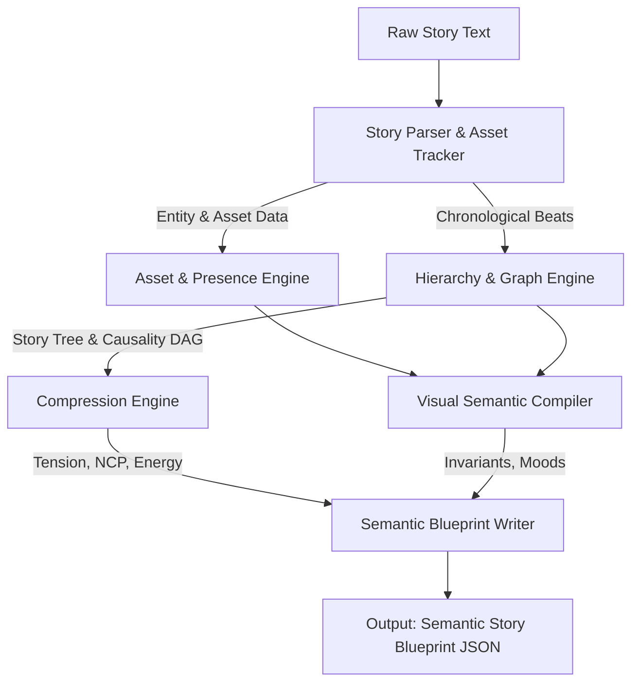

# Story Analyst Architecture

## Overview
The Story Analyst operates as a specialized narrative parsing and graph synthesis engine. It processes raw narrative text to construct a structured semantic database of story nodes, causal relationships, asset states, and continuity checkpoints, producing the **Semantic Story Blueprint (JSON)**.

---

## High-Level Data Flow



---

## Conceptual Model & Internal Modules

### 1. Story Parser & Asset Tracker
* Extracts raw sentences/paragraphs and parses them into chronological **beats** (action, dialogue, transition).
* Performs named entity recognition (NER) for characters and locations.
* Initiates tracking of key items (props) and maps their ownership, location, and condition.

### 2. Hierarchy & Graph Engine
* Structures chronological beats into a nested **Story Tree** (Story → Act → Sequence → Scene → Beat).
* Analyzes event logic to construct a directed **Causality Graph** showing setup-payoff dependencies.

### 3. Asset & Presence Engine
* Synthesizes the **Asset & Prop Graph** tracking state transitions (e.g., "sword: intact" → "sword: broken").
* Generates a lightweight **Presence Matrix** tracking which characters and props exist in each scene/beat.

### 4. Compression Engine
* Ranks scenes into **Importance Tiers** (Tier 1: Core, Tier 2: Subplot, Tier 3: Atmospheric).
* Computes **Pruning Rules** (e.g., "If Scene X is deleted, Scene Y must also be deleted" to maintain causality).
* Computes a **Narrative Energy Curve** tracking emotional tension and dramatic energy (0.0 to 1.0) per beat.

### 5. Visual Semantic Compiler
* Formulates stable, text-extracted **Visual Invariant Profiles** for characters and locations.
* Compiles **Mood & Theme Maps** tracking atmospheric states (e.g., "mood: lonely", "theme: betrayal") across segments.

### 6. Semantic Blueprint Writer & Exporter
* Combines all data representations into the structured JSON schema.
* Exposes **Reflection Verification Rules** to downstream validation agents.

---

## Semantic Story Blueprint Schema (JSON)

Downstream agents consume this standardized format. The Story Analyst does not embed camera directions or edit cuts, leaving those choices to the Director and Storyboard.

```json
{
  "metadata": {
    "version": "3.0.0",
    "analyzer_signature": "StoryAnalyst-v3",
    "timestamp": "2026-06-04T19:17:19Z",
    "story_title": "String"
  },
  "story_tree": {
    "title": "String",
    "type": "story",
    "children": [
      {
        "id": "act_id",
        "type": "act",
        "title": "String",
        "children": [
          {
            "id": "seq_id",
            "type": "sequence",
            "title": "String",
            "children": [
              {
                "id": "scene_id",
                "type": "scene",
                "title": "String",
                "beats": [
                  {
                    "id": "beat_id",
                    "type": "action|dialogue|transition",
                    "description": "String",
                    "tension": 0.0,
                    "energy": 0.0
                  }
                ],
                "tension_peak": 0.0,
                "primary_location": "loc_id"
              }
            ]
          }
        ]
      }
    ]
  },
  "causality_graph": {
    "nodes": [
      { "id": "beat_id", "description": "String" }
    ],
    "edges": [
      { "source": "beat_id", "target": "beat_id", "type": "causal_necessity|information_dependency" }
    ]
  },
  "character_relationship_graph": {
    "nodes": [
      { "id": "char_id", "name": "String", "archetype": "String", "traits": ["String"] }
    ],
    "edges": [
      { "source": "char_id", "target": "char_id", "type": "String", "valence": 0.0, "power_balance": 0.0 }
    ]
  },
  "asset_and_prop_graph": {
    "nodes": [
      { "id": "prop_id", "name": "String", "type": "weapon|document|key_item", "visual_descriptor": "String" }
    ],
    "states": [
      { "beat_id": "beat_id", "prop_id": "prop_id", "location": "loc_id|char_id", "state": "active|destroyed|hidden" }
    ]
  },
  "presence_matrix": [
    { "scene_id": "scene_id", "characters_present": ["char_id"], "props_present": ["prop_id"] }
  ],
  "visual_semantic_layer": {
    "stable_character_profiles": [
      {
        "id": "char_id",
        "name": "String",
        "visual_invariants": {
          "gender_age_ethnicity": "String",
          "face_features": "String",
          "body_build": "String",
          "clothing_style": "String"
        }
      }
    ],
    "stable_location_profiles": [
      {
        "id": "loc_id",
        "name": "String",
        "visual_invariants": "String"
      }
    ],
    "mood_theme_map": [
      { "segment_id": "act_id|seq_id|scene_id", "primary_mood": "String", "primary_theme": "String" }
    ]
  },
  "narrative_compression_model": {
    "importance_tiers": {
      "tier_1_core_path": ["scene_id|beat_id"],
      "tier_2_subplots": ["scene_id|beat_id"],
      "tier_3_atmospheric": ["scene_id|beat_id"]
    },
    "pruning_rules": [
      { "if_pruned": "scene_id|beat_id", "must_prune": ["scene_id|beat_id"] }
    ]
  },
  "reflection_verification_rules": [
    {
      "scene_id": "scene_id",
      "required_elements": ["String"],
      "forbidden_elements": ["String"],
      "continuity_checks": [
        { "prop_id": "prop_id", "expected_state": "String" }
      ]
    }
  ]
}
```

---

## Design Constraints
* **Narrative Fidelity:** Must represent only facts present in or logically inferred from the source text. No embellishment or visual hallucination.
* **Separation of Concerns:** Must not attempt to choose shot framing (close-up/wide-shot), lens specifications, lighting levels, or edit transitions.
* **Schema Conformity:** All outputs must strictly adhere to the defined blueprint structure.
