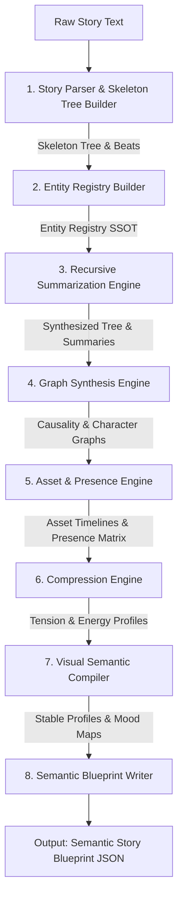

# Story Analyst Architecture

## Overview
The Story Analyst operates as a specialized narrative parsing, graph synthesis, and recursive summarization engine. It processes raw narrative text to construct a structured semantic database of story nodes, causal relationships, asset states, and continuity checkpoints, compiling them into a **Semantic Story Blueprint (JSON)**.

---

## High-Level Data Flow



---

## Conceptual Model & Internal Modules

### 1. Story Parser & Skeleton Tree Builder
* Parses raw text into chronological **beats** (action, dialogue, transition).
* Initializes the hierarchy structure, building a skeleton **Story Tree** (Story → Act → Sequence → Scene → Beat) containing only leaf beat content.

### 2. Entity Registry Builder & Alias Lineage (SSOT)
* Discovers, de-duplicates, and maps all characters, locations, and props to construct the Entity Registry.
* Registers entity aliases and name lineages to resolve raw names to canonical Registry IDs.

### 3. Recursive Summarization Engine
* Conducts bottom-up semantic synthesis:
  * Compiles `beat.description` into `beat.summary`.
  * Compiles child beat summaries in a scene into `scene.summary`.
  * Compiles child scene summaries in a sequence into `sequence.summary`.
  * Compiles child sequence summaries in an act into `act.summary`.
  * Synthesizes act summaries into the root-level `director_view` block (Executive Summary).

### 4. Graph Synthesis Engine
* Identifies causal linkages and info setups/payoffs to build the directed **Causality Graph**.
* Maps character relationship stances into temporal timelines with confidence scores referencing the Registry.

### 5. Asset & Presence Engine
* Tracks prop mutations chronologically, splitting timelines into `ownership_history`, `location_history`, and `state_history` referencing Registry IDs.
* Compiles the **Presence Matrix** tracking registered character and prop IDs present in each scene.

### 6. Compression Engine
* Ranks scenes into **Importance Tiers** (Tier 1: Core, Tier 2: Subplot, Tier 3: Atmospheric) based on relative tension range.
* Computes **Pruning Rules** to maintain narrative coherence.
* Maps a **Narrative Energy Curve** tracking tension and energy (0.0 to 1.0) per beat.

### 7. Visual Semantic Compiler
* Compiles stable **Visual Invariant Profiles** for characters and locations referencing Registry IDs.
* Generates **Mood & Theme Maps** tracking atmospheric states by batching scene summaries.

### 8. Semantic Blueprint Writer & Exporter
* Combines the recursive tree, graphs, models, and checklists into the structured JSON schema.
* Exposes **Reflection Verification Rules** for downstream automated quality checking.

---

## Semantic Story Blueprint Schema (JSON v3.1.0)

```json
{
  "metadata": {
    "version": "3.1.0",
    "analyzer_signature": "StoryAnalyst-Agent-v3",
    "timestamp": "2026-06-07T07:45:29Z",
    "story_title": "String"
  },
  "entity_registry": {
    "characters": {
      "char_id": {
        "id": "char_id",
        "name": "String",
        "aliases": ["String"],
        "archetype": "String",
        "traits": ["String"]
      }
    },
    "locations": {
      "loc_id": {
        "id": "loc_id",
        "name": "String",
        "aliases": ["String"]
      }
    },
    "props": {
      "prop_id": {
        "id": "prop_id",
        "name": "String",
        "aliases": ["String"],
        "type": "String",
        "visual_descriptor": "String"
      }
    }
  },
  "director_view": {
    "story_summary": "String",
    "main_characters": [
      { "id": "char_id", "role_in_plot": "String" }
    ],
    "main_conflicts": [
      { "conflict_type": "String", "description": "String", "resolution_point": "scene_id" }
    ],
    "critical_path_summary": [
      { "scene_id": "scene_id", "summary": "String" }
    ],
    "top_hooks": [
      {
        "beat_id":"...",
        "summary":"...",
        "hook_type":"mystery|action|emotional",
        "importance":0.95
      }
    ]
  },
  "story_tree": {
    "title": "String",
    "type": "story",
    "summary": "String",
    "children": [
      {
        "id": "act_id",
        "type": "act",
        "title": "String",
        "summary": "String",
        "children": [
          {
            "id": "seq_id",
            "type": "sequence",
            "title": "String",
            "summary": "String",
            "children": [
              {
                "id": "scene_id",
                "type": "scene",
                "title": "String",
                "summary": "String",
                "beats": [
                  {
                    "id": "beat_id",
                    "type": "action|dialogue|transition",
                    "description": "String",
                    "summary": "String",
                    "tension": 0.0,
                    "energy": 0.0
                  }
                ],
                "tension_peak": 0.0,
                "primary_location": "loc_id"
              }
            ]
          }
        ]
      }
    ]
  },
  "causality_graph": {
    "nodes": [
      { "id": "beat_id", "description": "String" },
      { "id": "scene_id", "description": "String" }
    ],
    "edges": [
      { "source": "beat_id|scene_id", "target": "beat_id|scene_id", "type": "causal_necessity|information_dependency" }
    ]
  },
  "character_relationship_graph": {
    "nodes": [
      {
        "id": "char_id",
        "name": "String",
        "aliases": ["String"],
        "archetype": "String",
        "traits": ["String"]
      }
    ],
    "edges": [
      {
        "source": "char_id",
        "target": "char_id",
        "timeline": [
          {
            "beat_id": "beat_id",
            "type": "String",
            "valence": 0.0,
            "power_balance": 0.0,
            "confidence": 0.95
          }
        ]
      }
    ]
  },
  "asset_and_prop_graph": {
    "nodes": [
      {
        "id": "prop_id",
        "name": "String",
        "aliases": ["String"],
        "type": "String",
        "visual_descriptor": "String",
        "ownership_history": [
          { "beat_id": "beat_id", "owner": "char_id" }
        ],
        "location_history": [
          { "beat_id": "beat_id", "location": "loc_id" }
        ],
        "state_history": [
          { "beat_id": "beat_id", "state": "active|destroyed|hidden" }
        ]
      }
    ],
    "states": []
  },
  "presence_matrix": [
    { "scene_id": "scene_id", "characters_present": ["char_id"], "props_present": ["prop_id"] }
  ],
  "visual_semantic_layer": {
    "stable_character_profiles": [
      {
        "id": "char_id",
        "name": "String",
        "visual_invariants": {
          "gender_age_ethnicity": "String",
          "face_features": "String",
          "body_build": "String",
          "clothing_style": "String"
        }
      }
    ],
    "stable_location_profiles": [
      {
        "id": "loc_id",
        "name": "String",
        "visual_invariants": "String"
      }
    ],
    "mood_theme_map": [
      { "segment_id": "act_id|seq_id|scene_id", "primary_mood": "String", "primary_theme": "String" }
    ]
  },
  "narrative_compression_model": {
    "importance_tiers": {
      "tier_1_core_path": ["scene_id|beat_id"],
      "tier_2_subplots": ["scene_id|beat_id"],
      "tier_3_atmospheric": ["scene_id|beat_id"]
    },
    "pruning_rules": [
      { "if_pruned": "scene_id|beat_id", "must_prune": ["scene_id|beat_id"] }
    ]
  },
  "reflection_verification_rules": [
    {
      "scene_id": "scene_id",
      "required_elements": ["String"],
      "forbidden_elements": ["String"],
      "continuity_checks": [
        { "prop_id": "prop_id", "expected_state": "String" }
      ]
    }
  ]
}
```

---

## Token Optimization & Serialization Modes (Sprint 3)

### 1. LLM Transport Key Minification & Decoration
To fit within strict API response limits (such as Groq's 8,192 token limit) and maximize speed, the Story Analyst uses transport-level optimization:
* **Key Minification:** Prompts instruct the LLM to return compact keys (e.g., `c`, `l`, `p` instead of `characters`, `locations`, `props`).
* **Python Reconstruction:** Python-side logic intercepts the raw JSON responses and maps the minified keys back to standard schema keys.
* **Property Decoration:** Default values (e.g., standard confidence scores, active states, unchanged emotional values) are omitted from the LLM prompt and filled programmatically by Python code.

### 2. Multi-Mode Blueprint Serialization
The Story Tree supports three output modes via `to_dict(mode, critical_beat_ids)`:
* **FULL:** Exports complete act, sequence, scene, and beat structures with all verbatim descriptions and summaries.
* **NORMAL (Default):** Strips verbose beat summaries while retaining descriptions, reducing the blueprint size by ~50%.
* **COMPACT:** Strips all non-critical beats, retaining only climax, hook, and prop-mutation beats to reduce blueprint context size by ~83%.

---

## Design Constraints
* **Narrative Fidelity:** Summaries must be faithful translations of child nodes. No external facts or stylistic formatting.
* **Separation of Concerns:** Must not attempt to choose shot framing (close-up/wide-shot), lens specifications, lighting levels, or edit transitions.
* **Schema Conformity:** All outputs must strictly adhere to the defined blueprint structure.
