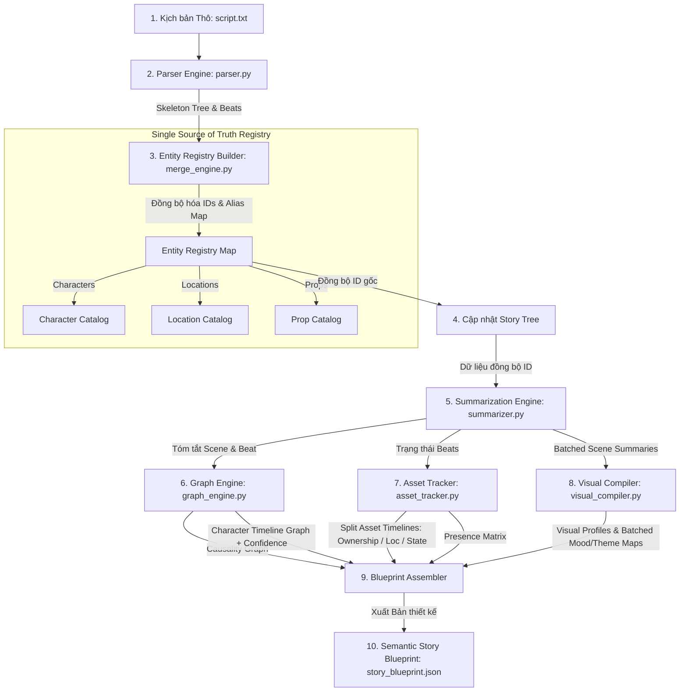

# Báo cáo Mô hình Kiến trúc và Luồng Dữ liệu (Story Analyst - Sprint 2)

Hệ thống **Story Understanding Engine (Story Analyst)** đã được nâng cấp lên kiến trúc **Sprint 2 (Semantic Quality & Registry Centricity)**. Dưới đây là mô tả chi tiết về mô hình kiến trúc mới, luồng dữ liệu tối ưu hóa và các KPI đo lường chất lượng cấu trúc.

---

## 1. Mô hình Kiến trúc Hệ thống (Architecture Model)

Mô hình kiến trúc mới đặt **Entity Registry (Bảng đăng ký thực thể)** làm trung tâm ngữ nghĩa (**Single Source of Truth - SSOT**). Tất cả các module trích xuất đồ thị, theo dõi đạo cụ, tóm tắt và phân tích thị giác phía sau đều tham chiếu và đồng bộ mã định danh (IDs) thông qua Registry này.



---

## 2. Dòng chảy Dữ liệu Chi tiết (Detailed Data Flow)

### Hồi 1: Thu thập và Thiết lập "Nguồn Chân Lý Duy Nhất" (SSOT Phase)
1. **Đọc và Phân tích Cấu trúc (Parser):**
   * Đọc kịch bản gốc và thực hiện **Scene Discovery** để xác định ranh giới phân cảnh (Scene) và hồi (Act).
   * Thực hiện **Beat Extraction** để tách văn bản gốc thành các Beat nguyên văn (verbatim) gán vào các phân cảnh.
2. **Khởi tạo Entity Registry (MergeEngine):**
   * **Ngay lập tức** sau khi phân tách Beat thô, hệ thống gọi LLM quét toàn bộ văn bản để tìm kiếm tất cả Characters, Locations, và Props.
   * **Entity Lineage (Alias Mapping):** Xác định tên chuẩn (Canonical Name), loại thực thể, và lập danh sách tất cả các biến thể tên gọi, biệt danh hoặc đại từ nhân xưng (ví dụ: `Lý Vân Tiêu`, `Lý thiếu gia`, `Cổ Phi Dương`, `hắn` đều thuộc thực thể `char_ly_van_tieu`).
   * Tạo dựng `alias_map` cấu trúc dạng `{"biến_thể_tên": "id_chuẩn_hoá"}`.
3. **Đồng bộ hóa Story Tree:**
   * Cập nhật các trường dữ liệu định danh của các node trong cây phân cấp (`primary_location`, `source_chunk`, `confidence`) về mã định danh chuẩn hóa của Registry.

### Hồi 2: Phân tích Ý nghĩa và Đồng bộ Đồ thị (Processing & Synthesis Phase)
4. **Tóm tắt Đệ quy Tối ưu hóa (Summarizer):**
   * Thực hiện cuộc gọi LLM gộp (Batched Call) cho từng Scene trong hạn mức ngân sách token (budget = 6,000) để sinh tóm tắt Beat và Scene.
   * Tổng hợp Bottom-Up: `Tóm tắt Phân cảnh` $\rightarrow$ `Chuỗi sự kiện` $\rightarrow$ `Hồi` $\rightarrow$ `Giám đốc trực quan (Director View)`.
5. **Đồ thị Quan hệ Nhân vật theo Thời gian (Graph Engine):**
   * Đọc danh sách nhân vật chuẩn từ Registry.
   * Truy vết sự thay đổi thái độ (stance evolution) của nhân vật qua dòng thời gian dưới dạng một **Timeline** các sự kiện (mỗi sự kiện gồm `beat_id`, `valence`, `power_balance`, và một thang điểm tin cậy `confidence` từ 0.0 đến 1.0).
6. **Theo dõi Đạo cụ Phân mảnh (Asset Tracker):**
   * Trích xuất các đột biến trạng thái của đạo cụ từ văn bản.
   * Tự động tính toán lan truyền trạng thái bằng Python và phân tách lịch sử của đạo cụ thành 3 dòng thời gian độc lập:
     * `ownership_history`: Ai là người sở hữu đạo cụ tại Beat nào?
     * `location_history`: Đạo cụ đang nằm ở bối cảnh nào?
     * `state_history`: Trạng thái đạo cụ (`active | destroyed | hidden`).
7. **Bản đồ Atmosphere & Theme Gộp (Visual Compiler):**
   * Thu thập tất cả tóm tắt Scene đã được tạo ở Bước 4.
   * Gửi toàn bộ danh sách tóm tắt Phân cảnh trong **một cuộc gọi LLM duy nhất** (Batched Prompt) để trích xuất `primary_mood` và `primary_theme` cho từng Scene, giúp tiết kiệm tối đa hạn ngạch gọi API và duy trì tính nhất quán của tone giọng phim.

### Hồi 3: Kiểm chuẩn và Xuất bản (Validation & Output Phase)
8. **Quy tắc Kiểm tra Phản xạ (Reflection Rules):**
   * Tạo các quy tắc thực tế dựa trên sự xuất hiện của thực thể và lịch sử trạng thái cuối cùng của đạo cụ trong Scene để cung cấp cho tác nhân Reflection kiểm chuẩn.
9. **Kiểm chuẩn KPI Kiến trúc:**
   * Thay thế điểm số đánh giá 10.0 ảo bằng các kiểm chuẩn ràng buộc cụ thể trước khi xuất bản.
10. **Tạo Blueprint JSON:** Xuất file [story_blueprint.json](file:///d:/record_by_me/README/CiB/outputs/story_blueprint.json).

---

## 3. Bản thiết kế Dữ liệu Ngữ nghĩa (Blueprint Output Schema v3.1.0)

Cấu trúc file JSON đầu ra tuân thủ nghiêm ngặt mô hình Registry Centricity:

```json
{
  "metadata": {
    "version": "3.1.0",
    "analyzer_signature": "StoryAnalyst-Agent-v3",
    "timestamp": "2026-06-07T14:49:10Z",
    "story_title": "The Rebirth of an Emperor"
  },
  "entity_registry": {
    "characters": {
      "char_ly_van_tieu": {
        "id": "char_ly_van_tieu",
        "name": "Lý Vân Tiêu",
        "aliases": ["Lý Vân Tiêu", "Lý thiếu gia", "Cổ Phi Dương", "hắn"],
        "archetype": "Protagonist",
        "traits": ["decisive", "knowledgeable"]
      }
    },
    "locations": {
      "loc_phong_hoc": {
        "id": "loc_phong_hoc",
        "name": "Phòng học",
        "aliases": ["phòng học", "lớp học"]
      }
    },
    "props": {
      "prop_phan_viet": {
        "id": "prop_phan_viet",
        "name": "Phấn viết",
        "aliases": ["đoạn phấn", "phấn viết"],
        "type": "weapon",
        "visual_descriptor": "Đoạn phấn viết bảng màu trắng"
      }
    }
  },
  "character_relationship_graph": {
    "nodes": [ /* Lấy trực tiếp từ Registry Characters */ ],
    "edges": [
      {
        "source": "char_ly_van_tieu",
        "target": "char_lac_van_thuong",
        "timeline": [
          {
            "beat_id": "beat_0dc37c51",
            "type": "adversary_confrontation",
            "valence": -0.6,
            "power_balance": 0.2,
            "confidence": 0.95
          }
        ]
      }
    ]
  },
  "asset_and_prop_graph": {
    "nodes": [
      {
        "id": "prop_phan_viet",
        "name": "Phấn viết",
        "ownership_history": [
          { "beat_id": "beat_0dc37c51", "owner": "char_lac_van_thuong" },
          { "beat_id": "beat_52a27405", "owner": "char_ly_van_tieu" }
        ],
        "location_history": [
          { "beat_id": "beat_0dc37c51", "location": "loc_phong_hoc" }
        ],
        "state_history": [
          { "beat_id": "beat_0dc37c51", "state": "active" }
        ]
      }
    ],
    "states": []
  }
}
```

---

## 4. Các KPI Kiến trúc Đo lường Chất lượng (Structural KPIs)

Chất lượng đầu ra của Story Analyst không còn được chấm bằng điểm số trung bình (ví dụ: `10.0`), mà được đánh giá bằng các tiêu chuẩn cơ cấu nghiêm ngặt sau:

| KPI | Ngưỡng yêu cầu | Ý nghĩa đối với Downstream Agents |
| :--- | :--- | :--- |
| **Không trùng lặp ID Thực thể** | $100\%$ | Tránh tạo các prompt sinh ảnh trùng lặp hoặc mâu thuẫn cho Storyboard. |
| **Không có Cạnh đồ thị mồ côi (Orphan edges)** | $100\%$ | Đảm bảo mọi cạnh quan hệ hoặc nhân quả đều kết nối các nút ID tồn tại trong Registry. |
| **Độ phủ Registry (Registry Coverage)** | $> 90\%$ | Đảm bảo hầu hết thực thể xuất hiện trong beat thô đều được định danh và theo dõi. |
| **Độ nhất quán Đạo cụ (Asset Continuity)** | $> 95\%$ | Đảm bảo tính liền mạch của trạng thái đạo cụ trên dòng thời gian (không có vật phẩm tự biến mất hoặc thay đổi trạng thái không lý do). |
| **Độ chính xác Timeline Mối quan hệ** | $> 95\%$ | Đảm bảo mọi chuyển dịch stance đều có beat cụ thể chứng minh kèm điểm tin cậy rõ ràng. |

---

## 5. Cơ chế Phục hồi khi Quá hạn ngạch (Quota Resilience Mechanism)

Hệ thống được thiết kế để chống chịu và tự phục hồi khi gặp các lỗi cạn kiệt hạn ngạch cuộc gọi (Gemini API 429 Quota/Rate Limits) trong suốt quá trình chạy kịch bản:

1. **Exponential Backoff & Retry**: Khi gặp lỗi 429, hệ thống sẽ tự động dừng lại và ngủ (`base_delay = 12 giây` nhân với tỉ lệ lũy thừa tăng dần theo số lần thử) trước khi thử lại cuộc gọi LLM. Tối đa 3 lần thử lại.
2. **QuotaLimitReachedException**: Nếu sau 3 lần thử lại dãn cách vẫn báo lỗi hết hạn ngạch (tổng cộng khoảng 4 lần gọi lỗi liên tiếp), hệ thống sẽ kích hoạt một ngoại lệ tùy chỉnh `QuotaLimitReachedException`.
3. **Graceful Partial Return (Trả lại kết quả bán thành phẩm)**: 
   * Đầu vào và tất cả các biến đầu ra cấu trúc trong `StoryAnalyst.analyze` được pre-initialize bằng dữ liệu mặc định rỗng.
   * Khi `QuotaLimitReachedException` được ném ra từ bất kỳ bước nào trong pipeline (ví dụ: đang ở bước 6 sinh đồ thị mối quan hệ thì cạn kiệt API), khối xử lý lỗi `try...except` tại bộ điều phối sẽ bắt được ngoại lệ, ngắt các cuộc gọi tiếp theo để tránh lãng phí thêm hạn ngạch, đồng thời lập tức đóng gói và xuất bản file `story_blueprint.json` chứa toàn bộ dữ liệu của các bước đã hoàn thành trước đó (ví dụ: đã hoàn thành `entity_registry`, `story_tree` và `causality_graph`).
   * Điều này giúp ngăn chặn kịch bản bị crash hoàn toàn, đảm bảo Director vẫn nhận được một bản phân tích bán thành phẩm hợp lệ để hoạt động tiếp.
